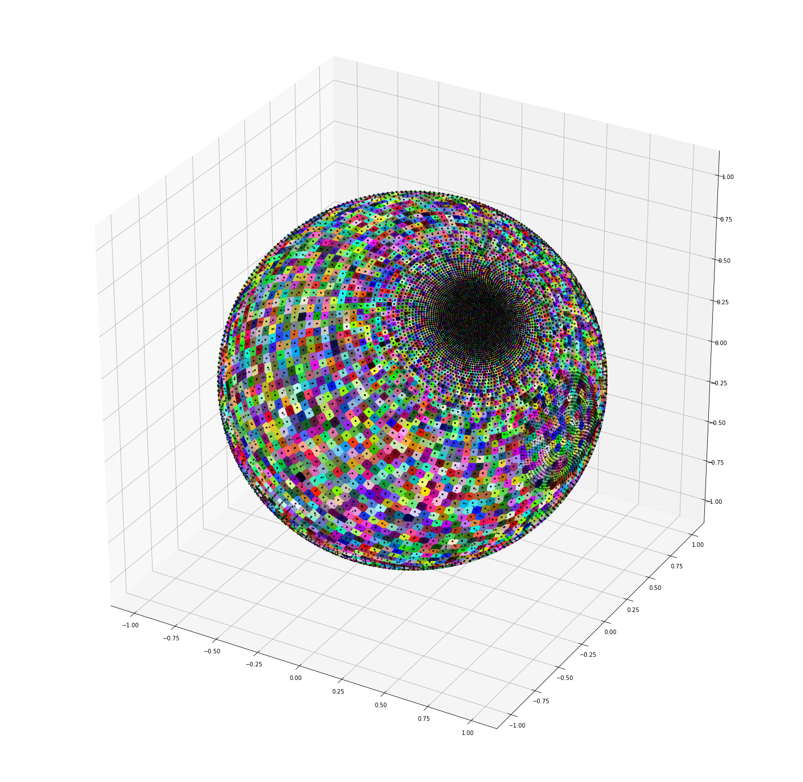

# Gauss Voronoi Grid


Dependencies: numpy, scipy, h5py, pandas, cartopy. Run below to install after cloning the repository:

```
conda install numpy scipy h5py pandas cartopy
```

This code can be used to create Gaussian Grids with various input arguments, such as the minimum and maximum grid point distances, the size of the areas of interest, the steepness of the decrease of gridpoint density, and the centers of the dense areas. Several other gauss grids can be added to create more areas of denser gridpoints. This is done by using the first given grid as background grid, then removing gridpoints from that background grid and adding the gridpoints from the other grids. 

Additionally, the voronoi cell surface areas for the grids can be calculated. If wanted, all gridpoints and voronoi cell areas on land can be removed. All this is then saved in .h5 files in the folder /GaussVoronoiGrid/grids.

At the moment, all this is done in the Jupyter Notebook 'GaussVoronoiGrid.ipynb'. The option of running it without Jupyter Notebooks will soon be added. 

For the Voronoi cell surface areas the code from the following sources was implemented:
https://github.com/tylerjereddy/spherical-SA-docker-demo/blob/master/docker_build/demonstration.py
https://github.com/MITHaystack/scikit-discovery/blob/master/skdiscovery/visualization/spherical_voronoi.py#L40

## Gaussian Grid Example

Below is an example of a Gaussian Grid with two dense areas. 


As mentioned, all gridpoints on land can be removed.


## Voronoi Cells

The Voronoi cells can also be plotted, although this is not recommended as it increases the computation time by a lot. 



A simpler way of visualising the Voronoi cell surface areas is using a scatter plot as seen below.


